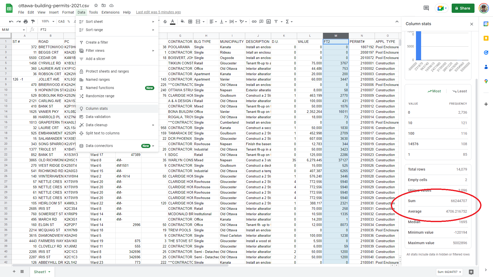

Each Markdown file should contain at least four of the following five components
2 block math equations
2 code blocks
2 image files
2 admonitions
1 margin content

# Understanding Data: Exploratory Data Analysis (EDA)

Write a comparison of my analysis techniques.

Screen capture of Google Sheets pivot table vs Python groupby
Inclure a LaTeX summary of the math formulas


As this point, we could already do some basic math operations, such as calculating the `sum` and `mean` of the `FT2` column. This will give us an estimate of the square footage of the construction and demolition projects on the City of Ottawa's territory in 2021. Here are the functions expressed in $\LaTeX$ and Python. **PUT REFERENCE TO MODULE 7 AND THE RESOURCES FROM ASSIGNMENT 7**.

**Sum**

$\LaTeX$

$$
\Sigma
=
x_1+x_2 +
\dots + x_n
$$

*Python*

```python
permits['FT2'].sum()
```

Running this code in a Jupyter Notebook returns this result: 66244707.

**Average**

$\LaTeX$

$$
\bar{x}
=
\frac{x_1 + x_2 + \dots + x+n}{n}
$$

*Python*

```python
permits['FT2'].mean()
```

Running this code in a Jupyter Notebook returns this result: 4706.2167519181585.

```{warning}
Since I have worked with this dataset in the past, I know that there are some duplicates. These duplicates were created by city staff on purpose in order to individually list the various street addresses attached to the same permit number, for example in the case of row houses. Therefore, at this point, our sum and average functions will include these duplicates.
```

To calculate the sum and average of the `FT2` column, we can use Google Sheets's `SUM` and `AVERAGE` functions. Alternatively, we can select the entire column we are interested in, and then click on Data > Column stats.



COMMENT TO THE EFFECT THAT THE RESULTS ARE THE SAME.